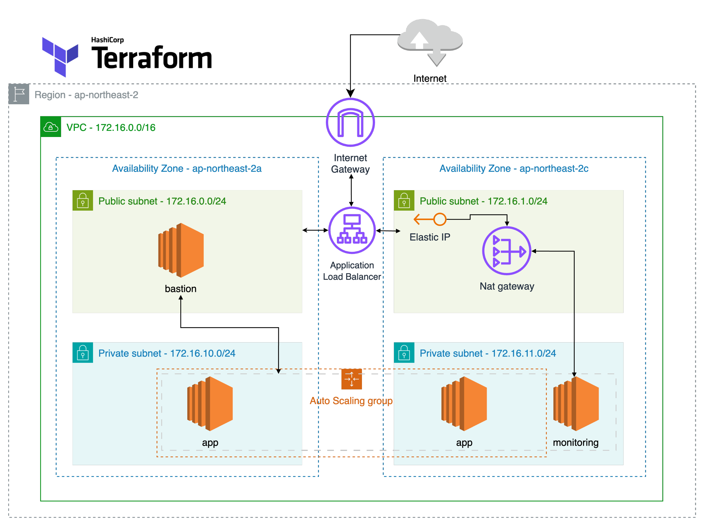

## 인프라 실행 방법

aws cli 와 terraform 설치 이후 다음 절차로 이미지 업로드 및 실행 합니다.

### 1. ECR 생성

```bash
terraform apply -target=module.ecr
```

Docker 이미지를 빌드 후 ECR 에 업로드합니다. 아래 주소는 예시로, 생성한 ECR 주소로 변경해야 합니다.

```bash
# 1. ECR 로그인
aws ecr get-login-password --region ap-northeast-2 \
  | docker login --username AWS --password-stdin 904233093972.dkr.ecr.ap-northeast-2.amazonaws.com

# 2. buildx로 linux/amd64 빌드, ECR Push
docker buildx build \
  --platform linux/amd64 \
  -t 904233093972.dkr.ecr.ap-northeast-2.amazonaws.com/acc-app:latest \
  --push .
```

### 2. 전체 인프라 생성

```bash
terraform apply
```

### 기타 자동화 및 편의 설정

get_asg_private_ips.sh: aws cli 로 asg 내부 인스턴스들의 private ip 목록과 az 를 출력하는 스크립트

update_ssh_config.sh: terraform apply 후 ~/.ssh/config 를 자동 갱신해 ssh <Host> 로 접근할 수 있게 해주는 스크립트

